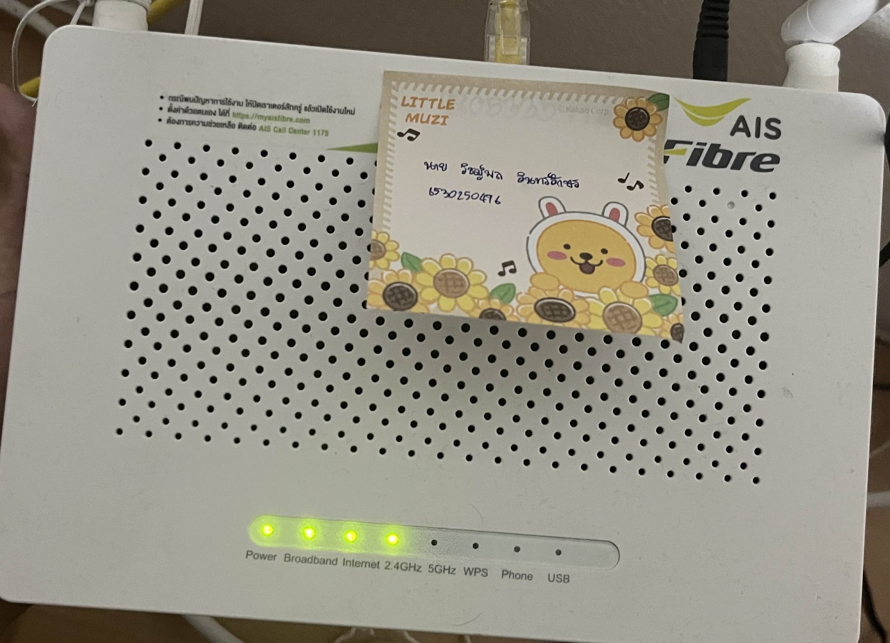

# Sercurity Control

[ Back to Homepage ](https://witchapolinaksorn.github.io)

# การตั้งค่า VPN (Virtual Private Network)

**Type of Security Controls :** Technical Control

**Control Functions :** Preventative

**Reason :** VPN (Virtual Private Network) ทำหน้าที่ เข้ารหัสทราฟฟิกและซ่อน IP Address ของผู้ใช้ ทำให้บุคคลภายนอกหรือแฮกเกอร์ไม่สามารถดักฟังข้อมูลหรือระบุตำแหน่งของอุปกรณ์ที่เชื่อมต่อเครือข่ายได้ ซึ่งช่วยป้องกันภัยคุกคามทางไซเบอร์ เช่น Man-in-the-Middle (MITM) Attacks, การดักจับข้อมูลผ่านเครือข่ายสาธารณะ (Public Wi-Fi), และการตรวจสอบหรือบล็อกทราฟฟิกโดยผู้ให้บริการอินเทอร์เน็ต (ISP)